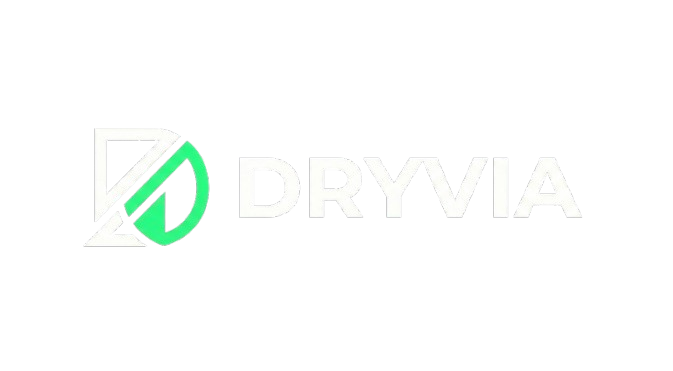
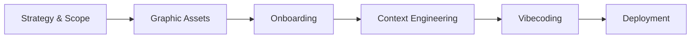

<!-- markdownlint-disable MD033 -->
<div align="center">
  
  <br />
  
  
  
  
</div>
<!-- markdownlint-enable MD033 -->

# Master Course: DRYVIA Aesthetic E-Commerce

Welcome to the **complete chronological handbook** for the **DRYVIA** project. This repository is a masterclass in modern, fullstack e-commerce development orchestrated by AI (**Antigravity**). 

DRYVIA disrupts the fitness equipment market with the first **indoor anti-sweat sneaker**—engineered specifically for studio training (HIIT, Cross-training, Yoga) to keep your feet, socks, and gym mats perfectly dry.

---

> [!IMPORTANT]
> **MVP Scope Definition**: 
> - Premium Landing Page with eco-performance storytelling.
> - High-density Product Shop with technical data visualization.
> - Secure Cart Management with real-time total calculation.
> - Optimized Mobile-First navigation for studio athletes.
> - **Zero** legacy bloat: Pure TypeScript orchestration from Day 1.

## Technical Core

| Layer | Implementation |
|---|---|
| **Philosophy** |  |
| **Frontend** |    |
| **Backend** |   |
| **Orchestration** |   |

#### Project Lifecycle: AI-Orchestrated E-Commerce Workflow


### The Final Result
The mission: Transform a strategic vision into a live, industrial-grade E-Commerce platform.

<div align="center">
  
</div>

---

## I. Strategic Framing

Every project begins with a clear **Intention**. DRYVIA was born from a specific vertical problem: the discomfort and hygiene issues of foot sweating during indoor fitness. We defined a strict "Eco-Performance" scope using our [Strategic Brief](docs/I.%20Cadrage%20strat%C3%A9gique/Concept%20&%20Strat%C3%A9gie%20Produit/Prompt%20%E2%80%94%20%20Concept%20&%20Strat%C3%A9gie%20Produit.md).

### Step 1.1: Product Niche & Solution Strategy
We identified a gap in the market for high-performance gym footwear that prioritizes moisture management and hygiene. Our strategy focuses on a technical anti-transfer moisture sole combined with breathable, recycled materials.

> **Excerpt from [Concept & Strategy](docs/I.%20Cadrage%20strat%C3%A9gique/Concept%20&%20Strat%C3%A9gie%20Produit/Prompt%20%E2%80%94%20%20Concept%20&%20Strat%C3%A9gie%20Produit.md):**
> - **Niche**: Indoor anti-sweat sports shoes for fitness studios.
> - **Solution**: Zero-transfer sole + antibacterial anti-odor membrane.
> - **Objective**: Keep feet, socks, and gym mats perfectly dry.

<div align="center">
  
</div>

### Step 1.2: Crafting the Brand Identity
Once the strategy was locked, we defined the **DRYVIA** visual DNA—a blend of Nike's aggressive performance and Apple's minimalist precision. The name itself bridges the benefit (*Dry*) and the journey (*Via*).

> **Excerpt from [branding.md](docs/IV.%20Context%20Engineering/Contexte/MarkDowns/branding.md):**
> - **Vibe**: Performance — Hygiene — Eco — Indoor Training.
> - **Positioning**: "Clean training starts at your feet."
> - **Tagline**: "Stay Dry. Train Hard."

<div align="center">
  
</div>

### Step 1.3: Strategic Synthesis Deliverable
All strategic research—from target persona mapping to competitive positioning—was synthesized into a master visual blueprint to align the technical and creative teams.

<div align="center">
  
</div>

---

## II. Graphic Collections & AI Orchestration

To avoid a "generic" or "empty" feel, we orchestrated a complete set of branded assets using high-fidelity AI models. Every visual follows the "Eco-Performance" design system, ensuring consistent branding across all product views.

### Step 2.1: The Identity & Branding Board
We synthesized our core design tokens—Deep Black, Neon Green, and Fresh Blue—into a comprehensive branding board that serves as the "source of truth" for the UI/UX implementation.

<div align="center">
  
</div>

### Step 2.2: Technical Product Asset Library
To provide total transparency for the consumer, we generated a full 360° technical library for the flagship DRYVIA sneaker, showcasing everything from the tech-mesh fabric to the anti-moisture sole.

<div align="center">

| [**Angle Front**](docs/II.%20Créations%20graphiques/Assets/angle-front.png) | [**Side View**](docs/II.%20Créations%20graphiques/Assets/side-view.png) | [**Sole View**](docs/II.%20Créations%20graphiques/Assets/sole-view.png) | [**Back View**](docs/II.%20Créations%20graphiques/Assets/back-view.png) |
|---|---|---|---|
|  |  |  |  |
| [**Hero Banner**](docs/II.%20Créations%20graphiques/Assets/hero-banner.png) | [**Gym Lifestyle**](docs/II.%20Créations%20graphiques/Assets/gym-lifestyle.png) | [**Tech Mesh**](docs/II.%20Créations%20graphiques/Assets/tech-mesh.png) | [**Logo Identity**](docs/II.%20Créations%20graphiques/Assets/logo-dark.png) |
|  |  |  |  |

</div>

### Step 2.3: Design Synthesis Deliverable
The creative phase concluded with a final synthesis image, rendering the product in its high-end performance context, ready for integration into the Next.js frontend.

<div align="center">
  
</div>

---

## III. Context Engineering: The AI Brain

AI-Assisted development is only as strong as its context. We established a "Knowledge Base" of technical specifications that provides full clarity to the coding agent, ensuring every architectural decision aligns with the DRYVIA brand.

### Step 3.1: AI Orchestration Prompt
We used **Context Engineering** to feed the AI with the precise DNA of the project. By defining clear roles and constraints, we transformed the strategic vision into industrial-grade technical documentation.

> **Excerpt from [Orchestration Prompt](docs/IV.%20Context%20Engineering/Contexte/Prompt%20-%20Context%20Engineering.md):**
> *"Act as a Senior Technical Writer & Project Scaffolding Specialist. Create a set of markdown files that will serve as the single source of truth for the 'DRYVIA' brand. Extract guidelines for branding, design systems, and product specifications. Ensure all content is professional, precise, and instruction-ready for developers."*

<div align="center">
  
</div>

### Step 3.2: Technical Knowledge Base
The output of our orchestration is a decentralized knowledge base. These files act as the project's "Source of Truth" for both human developers and AI agents:

- [**Branding DNA**](docs/IV.%20Context%20Engineering/Contexte/MarkDowns/branding.md): Visual & verbal identity rules.
- [**Design Tokens**](docs/IV.%20Context%20Engineering/Contexte/MarkDowns/design_system.md): Colors, typography, and spacing scales.
- [**Product Data**](docs/IV.%20Context%20Engineering/Contexte/MarkDowns/product_data.md): Flagship model specifications and mapping.
- [**Developer Context**](docs/IV.%20Context%20Engineering/Contexte/MarkDowns/context.md): Core architectural intent.
- [**Project Rules**](docs/IV.%20Context%20Engineering/Contexte/MarkDowns/project_rules.md): Coding standards and workflow logic.

---

## IV. Development Environment & Tooling

Industrial-grade development requires a robust, AI-native environment. We established a standardized workstation setup to ensure perfect synchronization between the local machine, the cloud repository, and our AI orchestration tools.

### Step 4.1: Version Control Foundations (Git Download)
Before writing a single line of code, we accessed the official **Git** portal to acquire the latest version of the industry-standard version control system.

<div align="center">
  
</div>

### Step 4.2: Industrial Installer Configuration
We executed the Git installer with optimized settings for industrial development, ensuring that our local command line is perfectly aligned with the DRYVIA project's requirements.

<div align="center">
  
</div>

### Step 4.3: Cloud Collaboration Account (GitHub)
To host the DRYVIA source code and enable AI-orchestrated deployment, we configured a professional **GitHub** account, bridging our local work with the global developer community.

<div align="center">
  
</div>

### Step 4.4: Strategic Repository Initialization
We initialized a dedicated "e-commerce" repository, defining its public visibility and strategic importance within the DRYVIA brand ecosystem.

<div align="center">
  
</div>

### Step 4.5: Repository Active & Ready
The final repository view confirms that our cloud staging environment is active, ready to receive the first commits of our premium sneakers platform.

<div align="center">
  
</div>

### Step 4.6: AI-Native IDE Acquisition (Trae)
The heart of our workflow is **Trae IDE**—the next-generation, AI-first editor. We downloaded the stable build to enable high-velocity "Vibe Coding" capabilities.

<div align="center">
  
</div>

### Step 4.7: Welcome to the Future of Coding
The Trae welcome screen marks the transition from traditional development to an AI-choreographed workspace, designed for maximum engineering speed.

<div align="center">
  
</div>

### Step 4.8: Secure Device Verification
Security is paramount. We performed a secure device verification to link our Trae instance with our digital identity, ensuring a safe building environment.

<div align="center">
  
</div>

### Step 4.9: Remote Repository Synchronization
We initiated the first clone of the DRYVIA repository directly within Trae, pulling our strategic foundations from the cloud into our local AI cockpit.

<div align="center">
  
</div>

### Step 4.10: The Builder Interface Activation
The final step in our environment setup: activating the **Trae Builder** interface, where the strategic context and code arborescence truly come to life.

<div align="center">
  
</div>

---

## V. Fullstack Architecture & Arborescence

The transitions from conceptual design to industrial-grade infrastructure are orchestrated via automated scaffolding. We established a project structure that is "AI-Transparent," providing full clarity to the coding agent during the build phase.

### Step 5.1: Automated Scaffolding Execution
To ensure a standardized and error-free environment, we utilized a custom **Bash Scaffolding Script**. This automation creates the complete decoupled architecture (Frontend, Backend, Docs) in milliseconds.

> **Excerpt from [create_structure.sh](create_structure.sh):**
> ```bash
> #!/bin/bash
> mkdir -p backend frontend docs
> mkdir -p backend/{config,controllers,middleware,models,routes,services,utils}
> mkdir -p frontend/src/{app,components/{layout,ui},features/products,lib,providers,types}
> ```

<div align="center">
  
</div>

```bash
# Option A: Linux / macOS / Git Bash
bash create_structure.sh

# Option B: Windows (PowerShell)
PowerShell -ExecutionPolicy Bypass -File create_structure.ps1
```

#### Desired Arborescence Schema
The resulting structure follows a strict separation of concerns, optimized for AI-assisted engineering:

```text
e-commerce/
├── backend/            # Express API (TS)
│   ├── controllers/    # Business Logic
│   ├── models/         # Data Schemas
│   └── routes/         # API Endpoints
├── frontend/           # Next.js 14 (App Router)
│   ├── src/app/        # Pages & Routing
│   ├── src/components/ # Atomic UI Elements
│   └── src/features/   # Product-specific logic
└── docs/               # Master Knowledge Base
```

### Step 5.2: Hierarchy Validation & Verification
Once the skeleton is generated, we perform a deep verification using the `tree` command. This step validates that every directory and configuration file is correctly placed for the build phase.

<div align="center">
  
</div>

### Step 5.3: Architectural Infrastructure Deliverable
The scaffolding phase concludes with a fully synchronized local environment, serving as the definitive deliverable for our structural engineering phase.

<div align="center">
  
</div>

---

## VI. Vibecoding & Build

The **Vibecoding** phase is where the architecture is filled with industrial-grade logic. Once the environment is cloned, dependencies installed, and the project structure validated, we launch the local services and visualize the application in the browser.

### Step 6.1: Launch Local Services & Web Preview
After copying the repository, running `npm install` in both `frontend` and `backend`, and confirming the arborescence (see Section V), we start the development servers. The frontend runs on **localhost:3000** and the API on **localhost:5000**, giving immediate visual feedback that the stack is operational.

<div align="center">
  
</div>

### Step 6.2: Full Session — Prompt-Driven Implementation
The core of our workflow: we paste the complete [Vibecoding Prompt](docs/V.%20Vibecoding/Prompt%20-%20Vibecoding.md) into the AI-assisted builder. In a single session, the agent interprets the plan, applies the design system, and implements the full stack—landing page, shop, cart, and checkout—driven entirely by the structured instructions in the prompt. The detailed roadmap lives in [Prompt - Vibecoding.md](docs/V.%20Vibecoding/Prompt%20-%20Vibecoding.md), with phases covering design system, backend API, layout (navbar, footer, cart), landing page (hero, sections), shop, and payment.

> [!TIP]
> **Vibe Tip**: We use `CartProvider` with `localStorage` persistence so users never lose their cart, even across sessions.

<div align="center">
  
</div>

### Step 6.3: Final Result & Verification
The outcome is a fully functional DRYVIA e-commerce experience. We then run through the critical paths: navigation, product listing, product detail, add-to-cart, and checkout—to confirm that all routes work and the code is correctly implemented. The result is satisfying and ready for the next phase (deployment or iteration).

<div align="center">
  
</div>

---

## 🏆 Mission Status
**Current State**: Documentation & Strategic Assets 100% Locked. Execution in Progress.

*This repository demonstrates the power of AI-orchestrated development. From niche product strategy to premium asset generation, we are building the future of fitness e-commerce.*