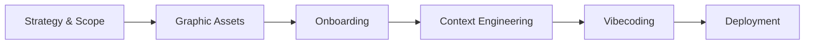

# DRYVIA E-Commerce — Documentation Index

This is the **docs folder** for the DRYVIA Aesthetic E-Commerce project. It contains all strategic, graphic, context-engineering, and deployment assets produced during the vibecoding master course (strategy, AI-generated visuals, scaffolding, markdown knowledge base, and Vercel deployment).

Below you will find a simplified tree of the docs structure, the project lifecycle diagram, and a full list of every resource with clickable links.

---

## Docs tree (simplified)

```
docs/
├── I. Strategic Framing
│   ├── Brand Identity/
│   ├── Strategy and Concept/
│   └── Livrable.png
├── II. Graphic Collections
│   ├── Assets/
│   ├── Prompts/
│   ├── graphic-collections.png, kling.png, kling-generate.png, Livrable.png
├── III. Development Environment
│   ├── Github et Git/
│   └── Trae IDE/
├── IV. Context Engineering
│   ├── Arborescence/
│   └── Contexte/
│       ├── MarkDowns/
│       └── Prompt - Context Engineering.md
├── V. Vibecoding
└── README.md
```

---

## Project lifecycle (AI-orchestrated e-commerce workflow)



---

## All documentation resources

### I. Strategic Framing

| Resource | Link |
|----------|------|
| Strategy and Concept (Markdown) | [Strategy and Concept.md](I.%20Strategic%20Framing/Strategy%20and%20Concept/Strategy%20and%20Concept.md) |
| Strategy and Concept (PDF) | [Strategy and Concept.pdf](I.%20Strategic%20Framing/Strategy%20and%20Concept/Strategy%20and%20Concept.pdf) |
| Strategy and Concept (Image) | [Strategy and Concept.png](I.%20Strategic%20Framing/Strategy%20and%20Concept/Strategy%20and%20Concept.png) |
| Prompt - Brand Identity | [Prompt - Brand Identity.md](I.%20Strategic%20Framing/Brand%20Identity/Prompt%20-%20Brand%20Identity.md) |
| Brand Identity (PDF) | [Brand Identity.pdf](I.%20Strategic%20Framing/Brand%20Identity/Brand%20Identity.pdf) |
| Brand Identity (Image) | [Brand Identity.png](I.%20Strategic%20Framing/Brand%20Identity/Brand%20Identity.png) |
| Strategic deliverable | [Livrable.png](I.%20Strategic%20Framing/Livrable.png) |

### II. Graphic Collections

**Assets**

| Resource | Link |
|----------|------|
| Angle Front | [angle-front.png](II.%20Graphic%20Collections/Assets/angle-front.png) |
| Back View | [back-view.png](II.%20Graphic%20Collections/Assets/back-view.png) |
| Gym Lifestyle | [gym-lifestyle.png](II.%20Graphic%20Collections/Assets/gym-lifestyle.png) |
| Hero Banner | [hero-banner.png](II.%20Graphic%20Collections/Assets/hero-banner.png) |
| Hero (Video) | [hero.mp4](II.%20Graphic%20Collections/Assets/hero.mp4) |
| Logo Dark | [logo-dark.png](II.%20Graphic%20Collections/Assets/logo-dark.png) |
| Logo Light | [logo-light.png](II.%20Graphic%20Collections/Assets/logo-light.png) |
| Side View | [side-view.png](II.%20Graphic%20Collections/Assets/side-view.png) |
| Sole View | [sole-view.png](II.%20Graphic%20Collections/Assets/sole-view.png) |
| Tech Mesh | [tech-mesh.png](II.%20Graphic%20Collections/Assets/tech-mesh.png) |

**Prompts**

| Resource | Link |
|----------|------|
| Prompt — angle-front | [Prompt — angle-front.md](II.%20Graphic%20Collections/Prompts/Prompt%20%E2%80%94%20%20angle-front.md) |
| Prompt — back-view | [Prompt — back-view.md](II.%20Graphic%20Collections/Prompts/Prompt%20%E2%80%94%20%20back-view.md) |
| Prompt — gym-lifestyle | [Prompt — gym-lifestyle.md](II.%20Graphic%20Collections/Prompts/Prompt%20%E2%80%94%20%20gym-lifestyle.md) |
| Prompt — hero-banner | [Prompt — hero-banner.md](II.%20Graphic%20Collections/Prompts/Prompt%20%E2%80%94%20%20hero-banner.md) |
| Prompt — logo-dark | [Prompt — logo-dark.md](II.%20Graphic%20Collections/Prompts/Prompt%20%E2%80%94%20%20logo-dark.md) |
| Prompt — logo-light | [Prompt — logo-light.md](II.%20Graphic%20Collections/Prompts/Prompt%20%E2%80%94%20%20logo-light.md) |
| Prompt — Product DNA | [Prompt — Product DNA.md](II.%20Graphic%20Collections/Prompts/Prompt%20%E2%80%94%20Product%20DNA.md) |
| Prompt — side-view | [Prompt — side-view.md](II.%20Graphic%20Collections/Prompts/Prompt%20%E2%80%94%20%20side-view.md) |
| Prompt — sole-view | [Prompt — sole-view.md](II.%20Graphic%20Collections/Prompts/Prompt%20%E2%80%94%20%20sole-view.md) |
| Prompt — tech-mesh | [Prompt — tech-mesh.md](II.%20Graphic%20Collections/Prompts/Prompt%20%E2%80%94%20%20tech-mesh.md) |

**Other**

| Resource | Link |
|----------|------|
| Graphic collections overview | [graphic-collections.png](II.%20Graphic%20Collections/graphic-collections.png) |
| Kling | [kling.png](II.%20Graphic%20Collections/kling.png) |
| Kling generate | [kling-generate.png](II.%20Graphic%20Collections/kling-generate.png) |
| Graphic deliverable | [Livrable.png](II.%20Graphic%20Collections/Livrable.png) |

### III. Development Environment

**Github et Git**

| Resource | Link |
|----------|------|
| Create repo form | [create-repo-form.png](III.%20Development%20Environment/Github%20et%20Git/create-repo-form.png) |
| Git download page | [git-download-page.png](III.%20Development%20Environment/Github%20et%20Git/git-download-page.png) |
| GitHub dashboard | [github-dashboard.png](III.%20Development%20Environment/Github%20et%20Git/github-dashboard.png) |
| GitHub landing | [github-landing.png](III.%20Development%20Environment/Github%20et%20Git/github-landing.png) |
| GitHub sign-up | [github-sign-up.png](III.%20Development%20Environment/Github%20et%20Git/github-sign-up.png) |
| Git installer wizard | [git-installer-wizard.jpg](III.%20Development%20Environment/Github%20et%20Git/git-installer-wizard.jpg) |
| Repo created view | [repo-created-view.png](III.%20Development%20Environment/Github%20et%20Git/repo-created-view.png) |

**Trae IDE**

| Resource | Link |
|----------|------|
| GitHub authorize Trae | [github-authorize-trae.png](III.%20Development%20Environment/Trae%20IDE/github-authorize-trae.png) |
| Trae builder interface | [trae-builder-interface.png](III.%20Development%20Environment/Trae%20IDE/trae-builder-interface.png) |
| Trae clone repo input | [trae-clone-repo-input.png](III.%20Development%20Environment/Trae%20IDE/trae-clone-repo-input.png) |
| Trae device verification | [trae-device-verification.png](III.%20Development%20Environment/Trae%20IDE/trae-device-verification.png) |
| Trae download page | [trae-download-page.png](III.%20Development%20Environment/Trae%20IDE/trae-download-page.png) |
| Trae welcome screen | [trae-welcome-screen.png](III.%20Development%20Environment/Trae%20IDE/trae-welcome-screen.png) |

### IV. Context Engineering

**Arborescence**

| Resource | Link |
|----------|------|
| Arborescence | [Arborescence.md](IV.%20Context%20Engineering/Arborescence/Arborescence.md) |
| create_structure.ps1 | [create_structure.ps1](IV.%20Context%20Engineering/Arborescence/create_structure.ps1) |
| create_structure.sh | [create_structure.sh](IV.%20Context%20Engineering/Arborescence/create_structure.sh) |
| Execute Scaffolding Script | [Execute Scaffolding Script.png](IV.%20Context%20Engineering/Arborescence/Execute%20Scaffolding%20Script.png) |
| Verify Arborescence | [Verify Arborescence.png](IV.%20Context%20Engineering/Arborescence/Verify%20Arborescence.png) |

**Contexte**

| Resource | Link |
|----------|------|
| Context Engineering (Image) | [Context Engineering.png](IV.%20Context%20Engineering/Contexte/Context%20Engineering.png) |
| Prompt - Context Engineering | [Prompt - Context Engineering.md](IV.%20Context%20Engineering/Contexte/Prompt%20-%20Context%20Engineering.md) |
| branding.md | [branding.md](IV.%20Context%20Engineering/Contexte/MarkDowns/branding.md) |
| context.md | [context.md](IV.%20Context%20Engineering/Contexte/MarkDowns/context.md) |
| design_system.md | [design_system.md](IV.%20Context%20Engineering/Contexte/MarkDowns/design_system.md) |
| product_data.md | [product_data.md](IV.%20Context%20Engineering/Contexte/MarkDowns/product_data.md) |
| project_rules.md | [project_rules.md](IV.%20Context%20Engineering/Contexte/MarkDowns/project_rules.md) |

**Other**

| Resource | Link |
|----------|------|
| Context deliverable | [Livrable.png](IV.%20Context%20Engineering/Livrable.png) |

### V. Vibecoding

| Resource | Link |
|----------|------|
| Final result (GIF) | [final-result.gif](V.%20Vibecoding/final-result.gif) |
| GitHub push | [github-push.png](V.%20Vibecoding/github-push.png) |
| Git push | [git-push.png](V.%20Vibecoding/git-push.png) |
| Live coding (GIF) | [live-coding.gif](V.%20Vibecoding/live-coding.gif) |
| Localhost | [localhost.png](V.%20Vibecoding/localhost.png) |
| npm run dev | [npm-run-dev.png](V.%20Vibecoding/npm-run-dev.png) |
| Prompt - Vibecoding | [Prompt - Vibecoding.md](V.%20Vibecoding/Prompt%20-%20Vibecoding.md) |
| Vercel dashboard | [vercel-dashboard.png](V.%20Vibecoding/vercel-dashboard.png) |
| Vercel deploy | [vercel-deploy.png](V.%20Vibecoding/vercel-deploy.png) |
| Vercel import | [vercel-import.png](V.%20Vibecoding/vercel-import.png) |
| Vercel successful build | [vercel-successful-build.png](V.%20Vibecoding/vercel-successful-build.png) |
